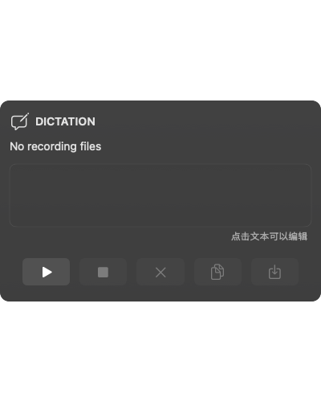
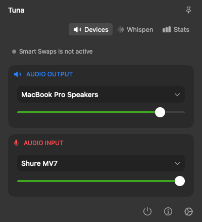
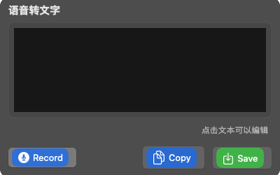
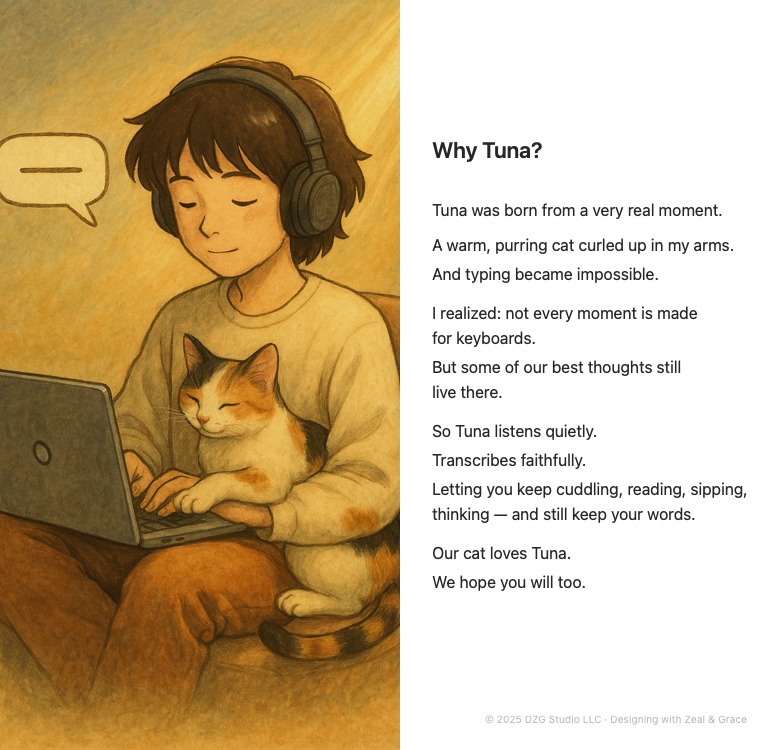
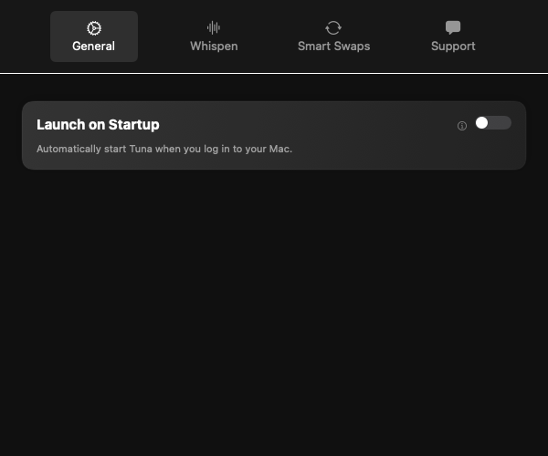
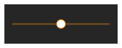
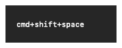
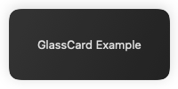
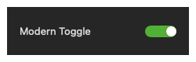

# Tuna 应用 UI 架构总结

## 整体架构

Tuna是一个macOS菜单栏应用程序，使用SwiftUI和AppKit构建。主要功能是音频控制和语音转文字。

### 应用入口点
- **AppDelegate**: 负责应用初始化、状态栏图标设置和弹出窗口管理
- **主要UI状态管理**:
  - 弹出窗口行为: 可切换固定/非固定模式
  - 事件监控: 捕获应用外点击事件以关闭弹出窗口

## 核心UI组件

### 1. 菜单栏视图 (MenuBarView)
**文件位置**: `Sources/Tuna/MenuBarView.swift`
**尺寸**: 固定宽度400px，高度439px
**布局结构**:
- **顶部区域**:
  - 标题栏: 展示应用名称和固定按钮
  - 标签页导航: 设备(Devices)、语音(Whispen)、统计(Stats)
- **内容区域**: 
  - 固定高度的滚动视图(319px)
  - 根据选定标签显示不同内容
- **底部按钮栏**:
  - 退出、关于、设置按钮
  - 固定10px垂直内边距

**视觉风格**:
- 使用毛玻璃效果(NSVisualEffectView)背景
- 暗色主题
- 圆角边缘

### 2. 设备卡片 (DeviceCards)
**状态**: 显示在"Devices"标签页
**组件**:
- **OutputDeviceCard**: 输出设备选择和控制
  - 设备下拉选择器
  - 音量控制滑块
- **InputDeviceCard**: 输入设备选择和控制
  - 设备下拉选择器
  - 音量等级显示

### 3. 语音转写界面 (DictationView)
**文件位置**: `Sources/Tuna/Views/TunaDictationView.swift`
**状态**: 显示在"Whispen"标签页
**主要组件**:
- 录音控制按钮
- 文本输入/编辑区域
- 转写状态指示器
- 文本操作菜单(复制/粘贴/格式化)

### 4. 快速录音窗口 (QuickDictationView)
**文件位置**: `Sources/Tuna/Views/TunaDictationView.swift`
**功能**: 支持通过快捷键激活的简化录音界面
**特点**:
- 精简布局
- 仅显示必要控制元素
- 响应全局快捷键

### 5. 设置视图 (TunaSettingsView)
**文件位置**: `Sources/Tuna/TunaSettingsView.swift`
**布局**:
- 标签页导航: 一般设置、Whispen设置、智能切换、支持
- 每个标签页包含相关设置卡片
- 使用统一的视觉风格

**视觉组件**:
- 玻璃卡片风格(GlassCard修饰器)
- 现代化开关样式(ModernToggleStyle)
- 强调色: 薄荷绿(Color.tunaAccent)

## 交互模式

### 1. 菜单栏交互
- 点击状态栏图标显示/隐藏主界面
- 支持窗口钉住模式(点击其他区域不会关闭)
- 标签页导航支持动画过渡

### 2. 快捷键集成
- 全局快捷键支持(通过KeyboardShortcutManager)
- 快速激活语音转写功能
- 自定义快捷键设置

### 3. 上下文菜单
- 文本区域支持右键菜单
- 录音控制和文本操作选项

## 文件组织

### 主要UI文件
- **MenuBarView.swift** (1297行): 主菜单视图
- **TunaSettingsView.swift** (1223行): 设置界面
- **TunaDictationView.swift** (1239行): 语音转写界面
- **AppDelegate.swift** (556行): 应用初始化和管理
- **SharedStyles.swift**: 共享样式定义

### 视图模型和数据流
- **AudioManager**: 管理音频设备状态和控制
- **DictationManager**: 管理语音转写功能
- **TunaSettings**: 全局设置存储
- **TabRouter**: 标签页路由管理

## 视觉设计规范

### 颜色系统
- 主背景: 深灰色(Color(red: 0.18, green: 0.18, blue: 0.18))
- 强调色: 薄荷绿(Color.tunaAccent)
- 文本颜色: 白色(主要)、半透明白色(次要)

### 字体规范
- 标题: 系统字体14pt, medium weight
- 正文: 系统字体13pt
- 小文本: 系统字体12pt

### 间距规范
- 卡片内边距: 16pt(水平), 16pt(垂直)
- 组件间距: 12pt(垂直)
- 按钮区内边距: 16pt(水平), 10pt(垂直)

### 元素风格
- 卡片: 圆角12pt, 半透明背景, 微弱边框
- 按钮: 无边框, hover状态显示背景
- 切换开关: 现代胶囊样式, 带动画效果

## 可访问性考虑

- 支持系统深色模式
- 图标包含辅助功能描述
- 使用标准系统控件提高兼容性
- 支持键盘导航和快捷键

## 已知UI问题

1. 在某些显示器缩放设置下可能出现对齐问题
2. 窗口固定状态在重启应用后需要再次点击才能恢复
3. 弹出窗口偶尔会有灰色阴影问题(已尝试解决)

## 建议的UI改进

1. 优化标签页切换时的内容显示，避免高度闪烁
2. 增强声音可视化效果
3. 改进智能设备切换的状态指示器
4. 改进文本编辑区域的响应性和光标控制
5. 添加更多主题选项和自定义色彩方案

### UI Snapshot Manifest

> **运行截图命令**  
> `cursor run gen-screenshot`  
> 

## Screens
- **MenuBarView**: 主菜单栏视图，固定宽度400px，高度439px
- **TunaDictationView**: 语音转写界面，显示在"Whispen"标签页
- **QuickDictationView**: 快捷键激活的简化录音界面
- **AboutCardView**: 关于页面，展示应用理念，宽780px，高750px
- **TunaSettingsView**: 设置界面，包含多个标签页

## Hierarchy
- **MenuBarView**
  - TitleBar: 应用名称 + 固定按钮
  - TabNavigation: 设备、语音、统计标签
  - ContentArea: 固定高度319px滚动视图
  - BottomBar: 退出、关于、设置按钮
- **TunaDictationView**
  - RecordingControls: 录音控制按钮
  - TextEditor: 文本输入/编辑区
  - StatusIndicator: 转写状态指示器
  - ContextMenu: 文本操作选项
- **QuickDictationView**
  - SimplifiedControls: 精简录音界面
  - TextArea: 转写文本区域
  - StatusIndicator: 录音状态指示
- **DeviceCards**
  - OutputDeviceCard: 输出设备选择 + 音量滑块
  - InputDeviceCard: 输入设备选择 + 音量显示
- **TunaSettingsView**
  - TabBar: 一般、Whispen、智能切换、支持
  - SettingsCards: 每个标签对应设置卡片

## Styles
- **Colors**
  - tunaAccent: Color(red: 0.3, green: 0.9, blue: 0.7) 薄荷绿
  - background: Color(red: 0.18, green: 0.18, blue: 0.18) 深灰色
  - textPrimary: .white
  - textSecondary: .white.opacity(0.8)
  - cardBackground: 毛玻璃效果，半透明深灰+微弱光晕
- **Typography**
  - title: system(size: 14, weight: .medium)
  - body: system(size: 13)
  - small: system(size: 12)
  - monospace: monospacedSystemFont(ofSize: 12, weight: .regular)
- **Layout**
  - cardPadding: 水平16pt，垂直16pt
  - componentSpacing: 垂直12pt
  - buttonPadding: 水平16pt，垂直10pt
  - cornerRadius: 12pt (卡片)，6pt (按钮)
- **Components**
  - GlassCard: 圆角12pt，半透明背景，微弱边框，轻微阴影
  - ModernToggleStyle: 胶囊形滑块开关，带动画效果
  - BidirectionalSlider: 双向滑块，自定义轨道和滑块按钮
  - ShortcutTextField: 自定义快捷键输入字段
  - GreenButtonStyle: 绿色圆角按钮，带悬停和按压效果

## CustomComponents
- **DevicePreferenceRow**: 设备选择行，包含图标、标题和下拉箭头
- **BidirectionalSlider**: 自定义双向滑块，支持从-50到50的值范围
- **ShortcutTextField**: 快捷键输入字段，自定义键盘事件处理
- **GlassCard**: 现代化玻璃卡片修饰器，带反光效果和微弱边框
- **ModernToggleStyle**: 现代开关样式，带弹簧动画效果

## DynamicStates
- **TabNavigation**: 标签切换使用withAnimation，带0.2秒过渡动画
- **PopoverPinning**: 菜单可固定，防止点击外部关闭
- **RecordingVisualization**: 录音状态可视化，带动画效果
- **ToggleAnimation**: 开关切换使用0.2秒弹簧动画效果
- **HoverStates**: 按钮和标签使用0.15秒淡入淡出动画显示悬停状态

## KnownIssues
1. 某些显示器缩放设置下可能出现对齐问题
2. 窗口固定状态在重启应用后需要再次点击才能恢复
3. 弹出窗口偶尔会有灰色阴影问题
4. 标签页切换时内容区域高度可能闪烁
5. 文本编辑区域的光标控制和响应性有待改进

## 主要界面预览

### MenuBarView
主菜单栏视图，固定宽度400px，高度439px

### TunaDictationView
语音转写界面，显示在"Whispen"标签页

### QuickDictationView
快捷键激活的简化录音界面

### AboutCardView
关于页面，展示应用理念，宽780px，高750px

### TunaSettingsView
设置界面，包含多个标签页

## UI组件层次

### MenuBarView
- TitleBar: 应用名称 + 固定按钮
- TabNavigation: 设备、语音、统计标签
- ContentArea: 固定高度319px滚动视图
- BottomBar: 退出、关于、设置按钮

### TunaDictationView
- RecordingControls: 录音控制按钮
- TextEditor: 文本输入/编辑区
- StatusIndicator: 转写状态指示器
- ContextMenu: 文本操作选项

### QuickDictationView
- SimplifiedControls: 精简录音界面
- TextArea: 转写文本区域
- StatusIndicator: 录音状态指示

### DeviceCards
- OutputDeviceCard: 输出设备选择 + 音量滑块
- InputDeviceCard: 输入设备选择 + 音量显示

### TunaSettingsView
- TabBar: 一般、Whispen、智能切换、支持
- SettingsCards: 每个标签对应设置卡片

## 样式规范

### Colors
- tunaAccent: Color(red: 0.3, green: 0.9, blue: 0.7) 薄荷绿
- background: Color(red: 0.18, green: 0.18, blue: 0.18) 深灰色
- textPrimary: .white
- textSecondary: .white.opacity(0.8)
- cardBackground: 毛玻璃效果，半透明深灰+微弱光晕

### Typography
- title: system(size: 14, weight: .medium)
- body: system(size: 13)
- small: system(size: 12)
- monospace: monospacedSystemFont(ofSize: 12, weight: .regular)

### Layout
- cardPadding: 水平16pt，垂直16pt
- componentSpacing: 垂直12pt
- buttonPadding: 水平16pt，垂直10pt
- cornerRadius: 12pt (卡片)，6pt (按钮)

### Components
- GlassCard: 圆角12pt，半透明背景，微弱边框，轻微阴影
- ModernToggleStyle: 胶囊形滑块开关，带动画效果
- BidirectionalSlider: 双向滑块，自定义轨道和滑块按钮
- ShortcutTextField: 自定义快捷键输入字段
- GreenButtonStyle: 绿色圆角按钮，带悬停和按压效果

## 自定义组件

### DevicePreferenceRow
设备选择行，包含图标、标题和下拉箭头

### BidirectionalSlider
自定义双向滑块，支持从-50到50的值范围

### ShortcutTextField
快捷键输入字段，自定义键盘事件处理

### GlassCard
现代化玻璃卡片修饰器，带反光效果和微弱边框

### ModernToggleStyle
现代开关样式，带弹簧动画效果

## 动态状态

### TabNavigation
标签切换使用withAnimation，带0.2秒过渡动画

### PopoverPinning
菜单可固定，防止点击外部关闭

### RecordingVisualization
录音状态可视化，带动画效果

### ToggleAnimation
开关切换使用0.2秒弹簧动画效果

### HoverStates
按钮和标签使用0.15秒淡入淡出动画显示悬停状态

## 已知问题

1. 某些显示器缩放设置下可能出现对齐问题
2. 窗口固定状态在重启应用后需要再次点击才能恢复
3. 弹出窗口偶尔会有灰色阴影问题
4. 标签页切换时内容区域高度可能闪烁
5. 文本编辑区域的光标控制和响应性有待改进

---
